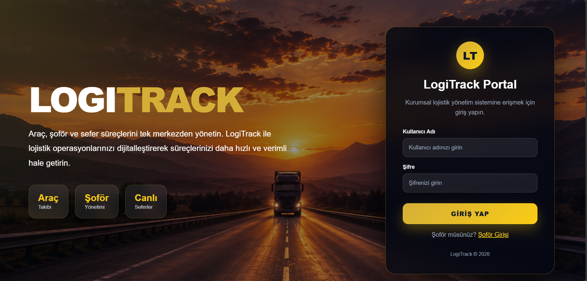
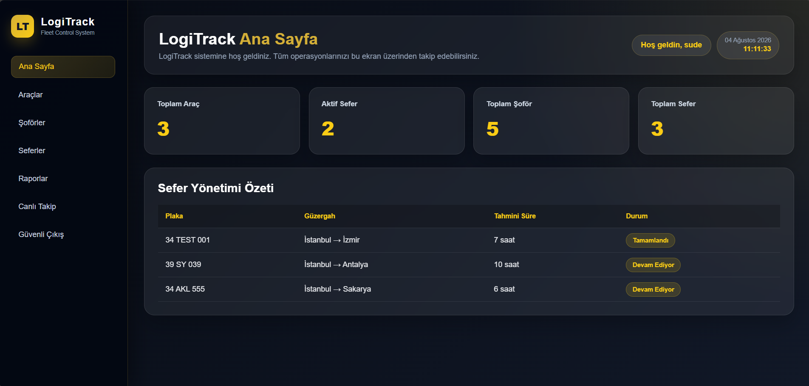
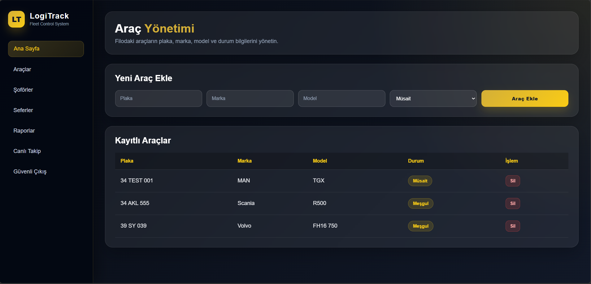
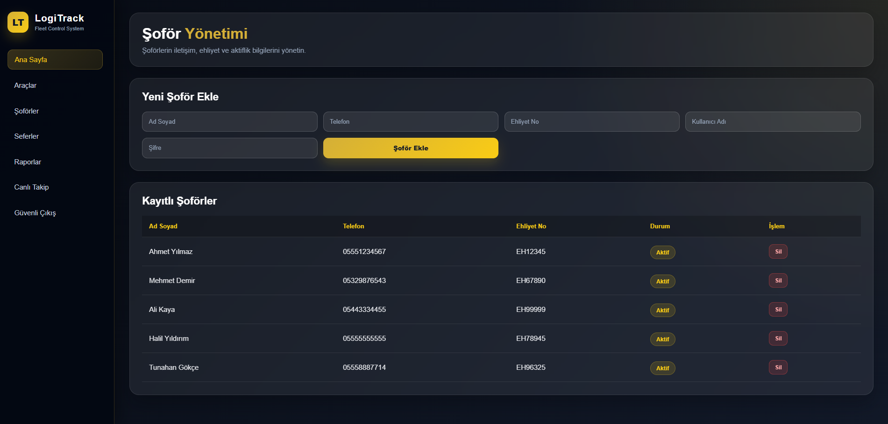
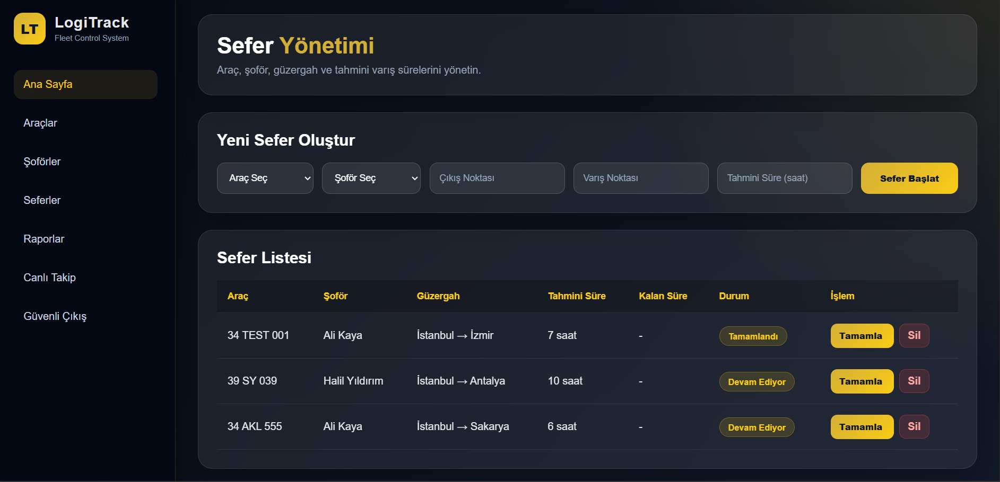
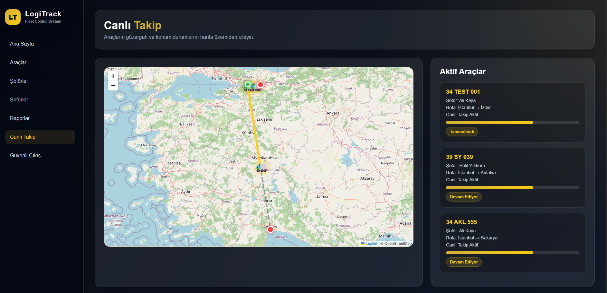
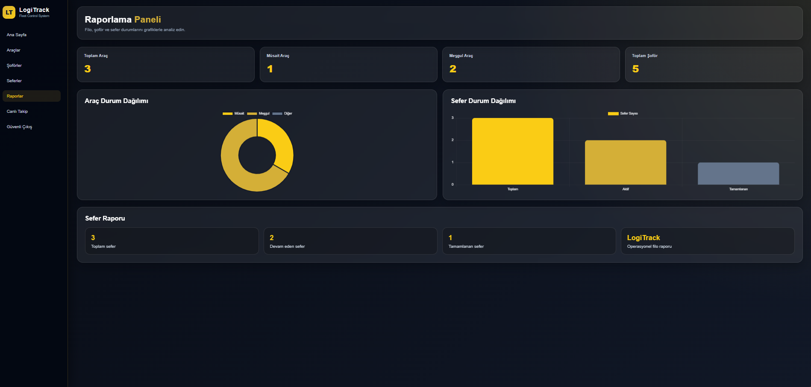
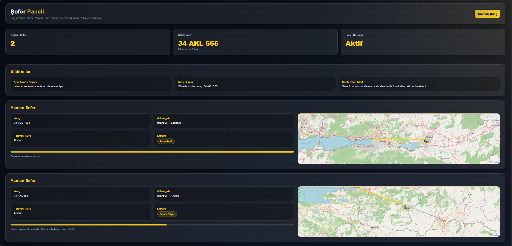

# LogiTrack - Akıllı Filo Takip Sistemi

## Proje Hakkında

LogiTrack, lojistik şirketlerinin araç, şoför ve sefer süreçlerini dijital ortamda yönetmesini sağlayan web tabanlı bir filo takip sistemidir.

Sistem sayesinde yöneticiler;

- Araç yönetimi
- Şoför yönetimi
- Sefer oluşturma
- Canlı araç takibi
- Raporlama
- Kullanıcı giriş sistemi

işlemlerini tek panel üzerinden gerçekleştirebilir.

---

## Kullanılan Teknolojiler

- Python
- Django
- SQLite
- HTML5
- CSS3
- JavaScript
- Leaflet.js
- OpenStreetMap

---

## Kullanıcı Rolleri

### Yönetici

- Dashboard
- Araç yönetimi
- Şoför yönetimi
- Sefer yönetimi
- Canlı Takip
- Raporlar

### Şoför

- Sisteme giriş
- Kendisine ait seferleri görüntüleme

---

## Kurulum

```bash
git clone https://github.com/SudeeYildirim/LogiTrack.git

cd LogiTrack

pip install django

python manage.py migrate

python manage.py runserver
```

---

## Proje Amacı

Bu proje, Yazılım Mühendisliği eğitimi kapsamında geliştirilmiş olup lojistik süreçlerinin dijital ortamda yönetilmesini amaçlamaktadır.

---

## Geliştirici

**Sude Yıldırım**

# Ekran Görüntüleri

## Yönetici Girişi



## Ana Sayfa



## Araç Yönetimi



## Şoför Yönetimi



## Sefer Yönetimi



## Canlı Takip



## Raporlar



## Şoför Girişi


## Şoför Paneli


